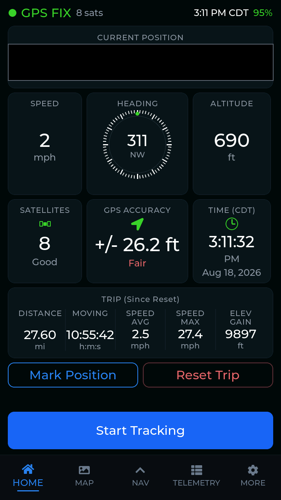
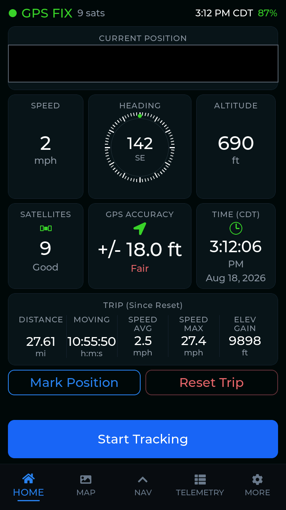
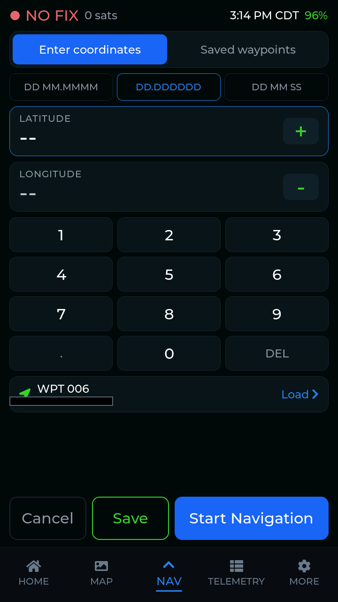
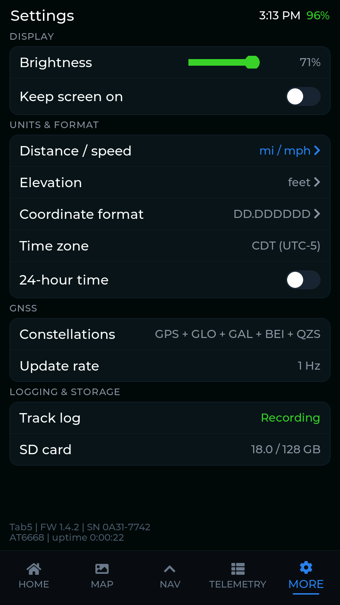

# M5Stack Tab5 GPS Handheld

A full handheld GPS navigation device built on the [M5Stack Tab5](https://docs.m5stack.com/en/core/Tab5) (ESP32-P4) — offline maps, waypoints, live navigation, and trip logging, running entirely on the device with no phone or network connection required.

Modeled loosely on classic dedicated handheld GPS units (think Garmin/Magellan): a real dashboard, a real map you can pan and zoom offline, and a nav screen that gets you to a point you typed or one you saved earlier.

## Screenshots

Captured live off real hardware (see `tools/pull_snapshot.py`) — position data blacked out.

<p>
  
  
  
  
</p>

## Features

- **Home dashboard** — live position, speed, heading (compass), altitude, satellite count, GPS accuracy estimate, a trip odometer (distance/moving time/avg+max speed/elevation gain, gated so parked GPS jitter doesn't inflate it), and a real battery gauge.
- **Offline map** — native, PPA-hardware-accelerated tile renderer (not LVGL) with pan/zoom/drag, tiles served from a microSD card, GPS-follow mode, and a live "you are here" marker.
- **Navigation** — type coordinates (three formats: DD MM.MMMM, DD.DDDDDD, DD MM SS, with live validation) or pick a saved waypoint, then get live bearing, relative-heading arrow, distance, ETA, closure rate (VMG), and cross-track error to the destination.
- **Waypoints** — mark your current position, or save a typed coordinate, with a scrollable saved list, tap-to-navigate, and delete-with-confirm. Persisted in a dedicated flash partition.
- **Telemetry** — per-satellite/per-constellation signal view (bar chart and polar sky view), DOP/fix-type, vertical speed, and position in all three coordinate formats.
- **Settings** — distance/speed units (mi/mph vs km/kmh), elevation units (ft vs m), coordinate format, 12/24-hour time, display brightness, keep-screen-on, and read-only GPS module info (constellations in view, update rate).
- **Trip and raw-track logging** — every NMEA sentence is logged to the SD card (append-only across boots, fsync'd per line so an abrupt power loss doesn't lose data), and the Home dashboard's trip totals now persist across a reboot too.
- Real US Central local time (DST-aware) derived from the GPS's own UTC time, no RTC or network needed.

## Hardware

- [M5Stack Tab5](https://docs.m5stack.com/en/core/Tab5) — ESP32-P4, MIPI-DSI touch panel, USB-Serial-JTAG.
- [M5Stack GPS Module v2.1](https://docs.m5stack.com/en/module/GPS%20Module) (AT6668 chipset) on the Tab5's M5-Bus connector, UART @ 115200 8N1.
- microSD card, for offline map tiles and GPS logging.
- Optional: an INA226-based battery gauge on the Tab5's onboard I2C bus (NP-F550-style 2S Li-ion pack).

## Building

Requires [ESP-IDF](https://github.com/espressif/esp-idf) v6.0.1, targeting `esp32p4`.

```sh
# after sourcing/activating your ESP-IDF v6.0.1 environment
idf.py build
idf.py -p <PORT> flash
```

This project targets the Tab5 exclusively — no board-selection variable needed.

## Repository layout

- `main/` — application source: GPS/NMEA parsing, the LVGL UI (dashboard/map-handoff/nav/telemetry/settings), the native map renderer, and persistence (settings, waypoints, trip totals).
- `components/esp_lcd_st7123/` — vendored LCD panel driver.
- `tools/` — development scripts:
  - `pull_snapshot.py` — pull a live screenshot of any LVGL screen over USB, optionally switching tabs first.
  - `fetch_tiles.py` / `arcgis_bundle_to_sd.py` — build the offline map tile dataset for the SD card.
  - `sdmount.sh` / `eject.sh` / `send_to_sd.py` / `recv_from_sd.py` — SD-card transfer workflows.
- `partitions.csv` — custom dual-OTA-slot partition table, with dedicated NVS partitions for settings, waypoints, and a raw screen-capture scratch region.

## License

Apache License 2.0 — see [LICENSE](LICENSE).
